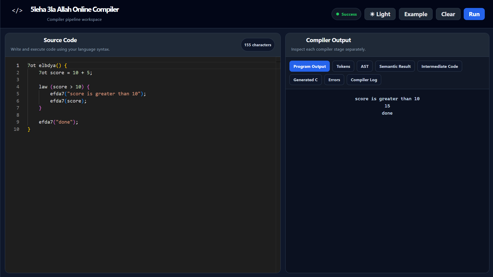
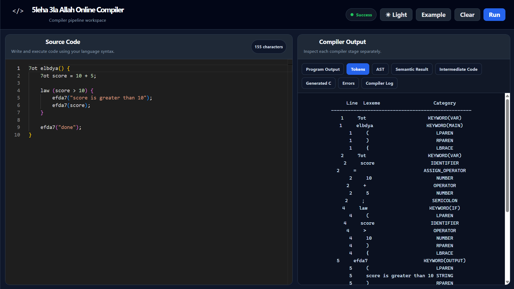
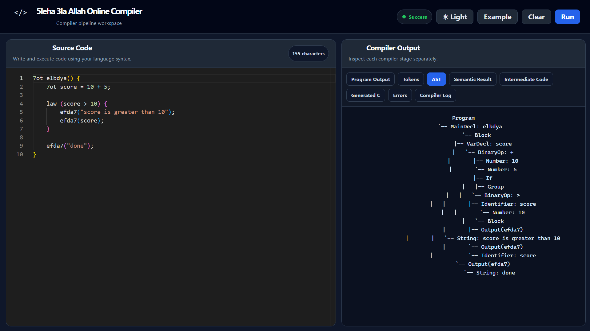
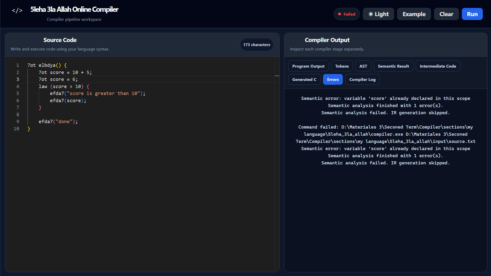
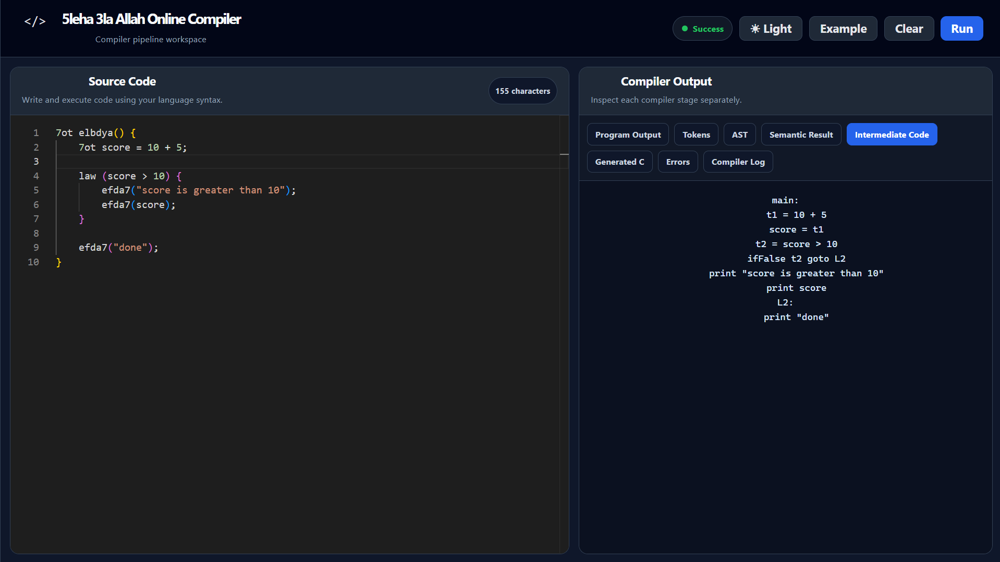
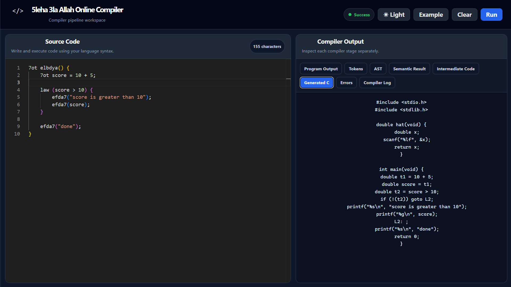
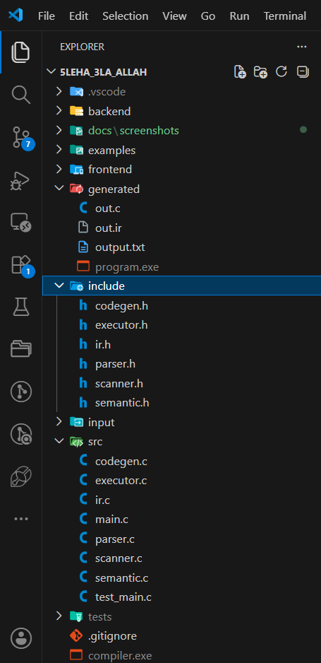
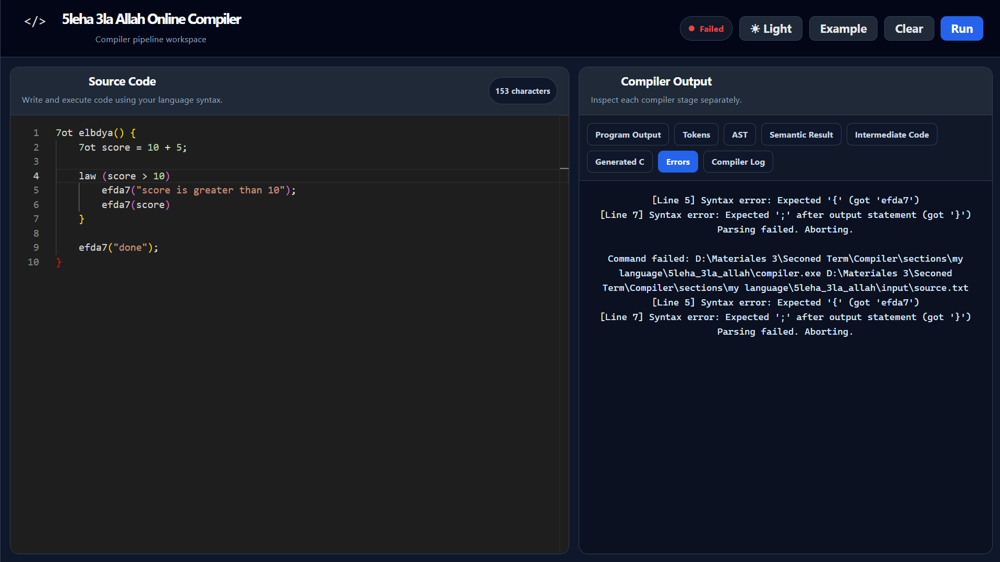

# 5leha 3la Allah Online Compiler

A custom programming language and full compiler pipeline built in **C**, connected to a **full-stack online compiler interface**.

The project implements the complete journey of a source program: scanning, parsing, semantic analysis, intermediate representation generation, C code generation, executable generation, and final program execution.



---

## Table of Contents

- [Overview](#overview)
- [Why This Project?](#why-this-project)
- [Demo](#demo)
- [Compiler Pipeline](#compiler-pipeline)
- [Language Syntax](#language-syntax)
- [Example Program](#example-program)
- [Supported Features](#supported-features)
- [Online Compiler Interface](#online-compiler-interface)
- [Project Structure](#project-structure)
- [Core Compiler Files](#core-compiler-files)
- [How to Run Locally](#how-to-run-locally)
- [Generated Files](#generated-files)
- [Error Handling](#error-handling)
- [Technologies Used](#technologies-used)
- [What I Learned](#what-i-learned)
- [Future Improvements](#future-improvements)
- [Author](#author)

---

## Overview

**5leha 3la Allah** is a custom Arabic/Egyptian-inspired programming language.

The language has its own syntax, keywords, scanner, parser, semantic analyzer, intermediate representation, code generator, and execution stage.

The compiler is written in **C**, and it is connected to a web-based online compiler interface that allows users to:

- Write source code
- Run the program
- View the program output
- Inspect tokens
- Inspect the AST
- Inspect semantic analysis results
- Inspect intermediate code
- Inspect generated C code
- View compiler errors and logs

---

## Why This Project?

This project was built to understand how programming languages work internally.

Instead of only creating a simple scanner or parser, this project connects the main compiler phases together and provides a practical online compiler interface.

The goal is to show the full process of transforming custom language code into executable output.

---

## Demo

The online compiler provides a workspace where the user can write code and run it directly from the browser.


---

## Compiler Pipeline

The compiler follows a complete multi-stage pipeline:

```txt
Source Code
   ↓
Scanner / Lexical Analysis
   ↓
Parser
   ↓
Abstract Syntax Tree
   ↓
Semantic Analysis
   ↓
Intermediate Representation
   ↓
C Code Generation
   ↓
Executable Generation
   ↓
Program Execution
   ↓
Program Output
```

### 1. Scanner / Lexer

The scanner reads the source code character by character and converts it into tokens.

It recognizes:

- Keywords
- Identifiers
- Numbers
- Strings
- Operators
- Assignment operator
- Equality operators
- Logical operators
- Parentheses
- Braces
- Semicolons
- Commas
- Comments



---

### 2. Parser

The parser receives the tokens and checks whether the code follows the grammar rules of the language.

It builds an **Abstract Syntax Tree (AST)** that represents the structure of the program.

The parser supports:

- Main function declaration
- Variable declaration
- Function declaration
- Function parameters
- Blocks
- If / else statements
- While loops
- For loops
- Return statements
- Break and continue statements
- Output statements
- Error output statements
- Expression statements
- Assignment expressions
- Arithmetic expressions
- Logical expressions
- Function calls



---

### 3. Semantic Analysis

The semantic analyzer checks the meaning of the program after parsing.

It validates:

- Variable declaration before use
- Function declaration before call
- Function parameter count
- Scope handling
- Duplicate declarations in the same scope
- Type compatibility
- Arithmetic operator rules
- Logical operator rules
- Comparison operator rules
- Return statement rules
- Break and continue usage inside loops



---

### 4. Intermediate Representation

After semantic analysis passes successfully, the compiler generates an **Intermediate Representation (IR)**.

The IR is a simplified representation of the program that makes code generation easier.

Example IR style:

```txt
t1 = 10 + 5
score = t1
t2 = score > 10
ifFalse t2 goto L1
print "score is greater than 10"
print score
L1:
print "done"
```



---

### 5. C Code Generation

The code generator converts the IR into valid C code.

The generated C code can then be compiled using GCC.



---

### 6. Executable Generation and Program Execution

The executor compiles the generated C code into an executable file, runs it, captures the program output, and displays it in the online compiler.

---

## Language Syntax

The language uses custom keywords inspired by Egyptian Arabic style.

| Keyword | Meaning |
|---|---|
| `7ot` | variable declaration |
| `elbdya` | main function |
| `law` | if statement |
| `gherKeda` | else statement |
| `lflf` | while loop |
| `do5` | for loop |
| `e3mel` | function declaration |
| `rag3` | return |
| `5las` | break |
| `kammel` | continue |
| `efda7` | print/output |
| `hat` | input |
| `bazet` | error print |
| `geb` | include |
| `true` | boolean true |
| `false` | boolean false |

---

## Example Program

```c
7ot elbdya() {
    7ot score = 10 + 5;

    law (score > 10) {
        efda7("score is greater than 10");
        efda7(score);
    }

    efda7("done");
}
```

### Output

```txt
score is greater than 10
15
done
```

---

## Supported Features

### Variables

```c
7ot x = 10;
7ot y = 20;
7ot result = x + y;
```

### Conditions

```c
law (result > 10) {
    efda7("greater than 10");
} gherKeda {
    efda7("less than or equal 10");
}
```

### Loops

```c
7ot i = 0;

lflf (i < 5) {
    efda7(i);
    i++;
}
```

### For Loop

```c
do5 (7ot i = 0; i < 5; i++) {
    efda7(i);
}
```

### Functions

```c
e3mel add(a, b) {
    rag3 a + b;
}
```

### Input

```c
7ot x = hat();
efda7(x);
```

### Output

```c
efda7("Hello from 5leha 3la Allah");
```

### Error Output

```c
bazet("Something went wrong");
```

---

## Online Compiler Interface

The web interface is designed as a compiler pipeline workspace.

It contains:

- Source code editor
- Run button
- Example button
- Clear button
- Status indicator
- Output inspection panel

The compiler output panel includes these tabs:

- Program Output
- Tokens
- AST
- Semantic Result
- Intermediate Code
- Generated C
- Errors
- Compiler Log


---

## Project Structure

```txt
5LEHA_3LA_ALLAH/
│
├── .vscode/
├── backend/
├── examples/
├── frontend/
├── generated/
├── include/
├── input/
├── src/
├── tests/
│
├── .gitignore
├── compiler.exe
├── scanner.exe
├── main.obj
├── main.pdb
└── vc140.pdb
```



---

## Core Compiler Files

| File | Responsibility |
|---|---|
| `scanner.c` | Converts source code into tokens |
| `parser.c` | Parses tokens and builds the AST |
| `semantic.c` | Performs semantic analysis and symbol table checks |
| `ir.c` | Generates intermediate representation |
| `codegen.c` | Converts IR into C code |
| `executor.c` | Compiles and runs the generated C code |
| `main.c` | Connects all compiler stages together |
| `scanner.h` | Defines token types, keyword types, and scanner functions |
| `parser.h` | Defines AST node types and parser functions |
| `semantic.h` | Defines symbol table structures and semantic analysis functions |
| `ir.h` | Defines IR instructions and IR program structure |
| `codegen.h` | Defines C code generation interface |
| `executor.h` | Defines compile and execution interface |

---

## How to Run Locally

### Prerequisites

Make sure you have:

- GCC installed
- Node.js installed
- npm installed

---

### 1. Clone the Repository

```bash
git clone https://github.com/YOUR_USERNAME/5leha-3la-allah-online-compiler.git
cd 5leha-3la-allah-online-compiler
```

---

### 2. Compile the C Compiler

```bash
gcc src/main.c src/scanner.c src/parser.c src/semantic.c src/ir.c src/codegen.c src/executor.c -I include -o compiler.exe
```

---

### 3. Run the Compiler from Terminal

```bash
./compiler.exe input/source.txt
```

On Windows, you can also run:

```bash
compiler.exe input/source.txt
```

---

### 4. Run the Backend

```bash
cd backend
npm install
npm run dev
```

---

### 5. Run the Frontend

```bash
cd frontend
npm install
npm run dev
```

Then open:

```txt
http://localhost:5173
```

---

## Generated Files

After running the compiler, the project generates compiler output files inside the `generated/` folder.

```txt
generated/out.ir
generated/out.c
generated/program.exe
generated/output.txt
```

These files are produced automatically from the source program.

---

## Error Handling

The compiler can report different types of errors.

### Lexical Errors

Examples:

- Unknown character
- Invalid token
- Too long identifier
- Too long string

### Syntax Errors

Examples:

- Missing semicolon
- Missing closing brace
- Invalid expression
- Invalid function declaration
- Invalid loop structure

### Semantic Errors

Examples:

- Variable used before declaration
- Function used before declaration
- Duplicate declaration in the same scope
- Wrong number of function arguments
- Type mismatch in expressions
- Invalid operator usage
- `break` used outside loop
- `continue` used outside loop



---

## Example Screenshots

### Program Output


### Tokens


### AST


### Semantic Result


### Intermediate Code


### Generated C


### Errors


---

## Technologies Used

### Compiler Side

- C
- GCC
- Lexical Analysis
- Recursive Descent Parsing
- Abstract Syntax Tree
- Symbol Table
- Semantic Analysis
- Intermediate Representation
- C Code Generation
- Executable Generation

### Web Side

- Node.js
- Backend API
- Frontend application
- Browser-based compiler interface
- Local compiler execution

---

## What I Learned

Through this project, I learned how a programming language is processed internally by a compiler.

I implemented the major compiler phases and connected them together in one pipeline.

I also learned how to connect a compiler written in C with a full-stack web application to create an online compiler experience.

---

## Future Improvements

- Add arrays
- Add more data types
- Add comments highlighting in the online editor
- Add syntax highlighting for the custom language
- Improve error messages with better line and column tracking
- Add function return type checking
- Add better runtime input handling in the online compiler
- Add saved programs
- Add user authentication
- Add deployment for the online compiler
- Add a live demo video

---

## Author

Developed by **Maria Ashraf Haleem**

LinkedIn: [https://www.linkedin.com/in/mariaashraf2004/]